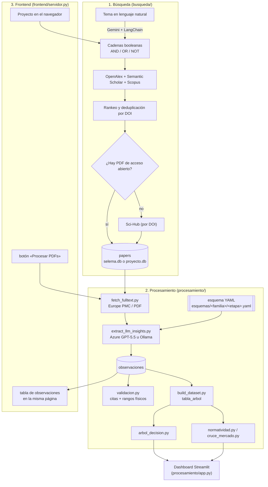

# Research Automator

Research Automator es una herramienta de IA (LLM + RAG) para revisiones de literatura científica. A partir de un tema en lenguaje natural genera cadenas de búsqueda booleanas, las ejecuta en varias plataformas académicas, rankea y deduplica los papers, descarga su texto completo y extrae hallazgos estructurados con un LLM.

El proyecto está estructurado en tres módulos independientes que se combinan en el frontend:

- **Búsqueda** (`busqueda/`) — recolección de papers.
- **Procesamiento** (`procesamiento/`) — extracción y análisis con LLM.
- **Frontend** (`frontend/`) — interfaz web que combina los dos anteriores.

---

## Flujo general



Hay dos formas de recorrer este flujo:

1. **Por línea de comandos**, módulo por módulo, contra la base global `busqueda/output/selema.db` (ver `COMANDOS.md`).
2. **Por el frontend** (`frontend/servidor.py`): cada proyecto que creas en el navegador vive en su propia base (`busqueda/output/proyectos/<nombre>.db`) y ahí mismo puedes correr "Procesar PDFs" sin tocar la terminal.

---

## Instalación

```bash
python3 -m venv venv
source venv/bin/activate
pip install -r requirements.txt       # todo el proyecto
# o, si solo quieres la búsqueda (sin LLM ni Streamlit):
pip install -r busqueda/requirements.txt
```

Copia `.env.example` a `.env` en la raíz y completa las keys que necesites (detalle de cada una más abajo).

---

## 1. Búsqueda (`busqueda/`)

Automatiza la generación de cadenas de búsqueda y la recolección de papers.

- **Generación de cadenas**: un LLM (Gemini vía LangChain) convierte el tema en lenguaje natural en cadenas booleanas (`AND`/`OR`/`NOT`), editables antes de lanzar la búsqueda (`generar_cadenas.py`).
- **Papers científicos**: busca en paralelo en [OpenAlex](https://openalex.org), [Semantic Scholar](https://www.semanticscholar.org) y Scopus; fusiona resultados, rankea y busca copias de acceso abierto.
- **Acceso a texto completo**: integra [Sci-Hub](https://sci-hub.ru) (opcional, `USAR_SCIHUB` en `config.py`) para resolver PDFs por DOI cuando las plataformas tienen el archivo bloqueado.
- **Datos de mercado**: consulta USDA FoodData Central para composición nutricional de productos comerciales (`fetch_usda.py`).
- **Autonomía**: todo se guarda en SQLite. Corriendo por línea de comandos no necesita ningún LLM salvo para generar las cadenas (eso solo pasa en el frontend).

```bash
cd busqueda
python main.py
```

Configuración en `busqueda/config.py` (`PAPER_QUERIES`, `USDA_QUERIES`, años mínimos, `USAR_SCIHUB`, etc.).

---

## 2. Procesamiento (`procesamiento/`)

Toma los papers de la búsqueda y extrae hallazgos estructurados con un LLM, los valida, y los cruza con normatividad y mercado.

### 2.1 Texto completo
`fetch_fulltext.py` descarga métodos/resultados desde Europe PMC o el PDF de acceso abierto, y selecciona los fragmentos con datos de proceso (temperatura, tiempo, pH, composición...) que se le pasan al LLM.

### 2.2 Extracción con LLM
`extract_llm_insights.py` envía los papers en lotes al LLM configurado en `config_proc.py` (`LLM_PROVEEDOR`):

- **`"azure"` (por defecto)**: un deployment de **GPT-5.5 en Azure AI Foundry**. Necesita `AZURE_OPENAI_ENDPOINT` y `AZURE_OPENAI_API_KEY` en `.env`; el nombre del deployment y el `api-version` van en `config_proc.py` (no son secretos). Pruébalo con `python probar_azure_openai.py`.
- **`"ollama"`**: modelo local (sin costo, sin cuota, más lento). Instala [Ollama](https://ollama.com) y descarga un modelo (`ollama pull qwen2.5:7b`).

El resultado se valida (`validacion.py`: citas verificadas contra el texto, rangos físicos razonables) y se guarda en la tabla `observaciones` (una fila por comparación + variable medida).

Es incremental: cada paper se cachea por un hash de su contenido + la versión del esquema; si no cambia ninguno de los dos, no se vuelve a enviar al LLM (ni se vuelve a pagar esa llamada).

### 2.3 Esquema dinámico por familia/etapa — **nuevo**
Antes el esquema de "qué campos tiene una observación" estaba escrito a mano para lácteos (`esquema.py`). Ahora es un archivo YAML versionado en git por cada combinación **(familia de producto, etapa de proceso)**:

```
procesamiento/esquemas/
├── leche/
│   └── general.yaml        # migración 1:1 del esquema.py original
└── biochar/
    ├── pirolisis.yaml       # borrador, sin confirmar con el equipo
    └── caracterizacion.yaml # borrador, sin confirmar con el equipo
```

`esquema_dinamico.py` lee uno de estos archivos y construye en caliente el modelo Pydantic + los enums que necesita el LLM (vocabularios cerrados: el LLM no puede inventar una categoría que no esté en la lista). Cada archivo declara:

```yaml
familia: biochar
etapa: pirolisis
version: 1
enums:
  atmosfera: [nitrogeno, argon, vacio, sin_control, otro]
campos:
  temperatura_pirolisis_c:
    tipo: numero
    obligatorio: false
    descripcion: "Temperatura máxima de pirólisis en °C"
  atmosfera:
    tipo: enum
    enum: atmosfera
    obligatorio: false
```

**Estado actual:** el esquema dinámico ya existe y ya se probó de punta a punta (lácteos y biochar), pero `extract_llm_insights.py` todavía **no elige esquema según la familia del proyecto** — siempre usa `esquema.py` (que a su vez carga `leche/general.yaml`). Conectar eso es trabajo pendiente (ver Roadmap).

### 2.4 Árbol de decisiones, normatividad y mercado
- `build_dataset.py` arma `tabla_arbol` (una fila por observación válida) y exporta CSVs a `procesamiento/output/`.
- `arbol_decision.py` entrena un árbol de decisiones (scikit-learn) sobre esa tabla y muestra sus reglas en lenguaje claro, con el veredicto normativo de cada una.
- `normatividad.py` evalúa hallazgos y productos contra los límites legales de `normas.csv` (Colombia/Codex por defecto, configurable en `config_proc.py`).
- `cruce_mercado.py` cruza un perfil de características con los productos reales del mercado (USDA).

### 2.5 Dashboard
`streamlit run app.py` abre el mapa de evidencia, comparaciones de mercado y normatividad en el navegador.

### 2.6 Document Intelligence — configurado, todavía no conectado al pipeline
Hay un recurso de **Azure AI Document Intelligence** probado y funcionando (`python probar_document_intelligence.py`, usa `AZURE_DOCUMENT_INTELLIGENCE_ENDPOINT`/`_API_KEY`), pero **ningún script lo llama todavía** — `fetch_fulltext.py` sigue usando `pypdf` (solo texto, sin tablas). Conectarlo es parte de la Fase 3 del roadmap de abajo (extracción de tablas con `pymupdf`/Document Intelligence).

```bash
cd procesamiento
python probar_azure_openai.py          # prueba de conexión con GPT-5.5
python probar_document_intelligence.py # prueba de conexión con Document Intelligence
python fetch_fulltext.py               # descarga texto completo
python extract_llm_insights.py         # extrae hallazgos con el LLM
python build_dataset.py                # arma la tabla y genera CSVs
python arbol_decision.py               # entrena el árbol de decisiones
streamlit run app.py                   # dashboard
```

---

## 3. Frontend (`frontend/`)

Interfaz web que combina Búsqueda y Procesamiento. Cada proyecto de investigación:

1. Se describe en lenguaje natural → genera cadenas de búsqueda editables.
2. Lanza la búsqueda → resultados rankeados, con selección manual de papers.
3. Los resultados tienen dos pestañas. **Resultados de búsqueda** es la tabla de papers (filtros, selección, exportar CSV). **Resultados de procesamiento** es donde se lanza "Procesar PDFs": se elige el alcance (la selección o todos, con un tope por corrida de `MAX_PAPERS_PROCESAR_WEB` en `config_proc.py`) y corre `fetch_fulltext.py` + `extract_llm_insights.py` sobre la base propia de ese proyecto (`busqueda/output/proyectos/<nombre>.db`), **nunca** sobre `selema.db`.
4. Mientras corre, esa pestaña muestra el avance por paper y el log; al terminar, el resumen (observaciones, papers con hallazgos, estado por paper) y la tabla de observaciones: efecto (mejora / empeora / sin diferencia / mixto), factor evaluado vs. referencia, variable, categoría, cita textual y validación, agrupadas por paper o por categoría, con filtros y exportación a CSV. Si la corrida falla o se cancela, lo ya extraído queda como resultado parcial y se puede reintentar (los papers ya extraídos no se vuelven a enviar al modelo).

El diseño de la pestaña de procesamiento viene de Claude Design (sistema Nocturne); sus estilos están al final de `frontend/web/app.css`.

```bash
cd frontend
python servidor.py        # abre http://127.0.0.1:8000
python servidor.py 8080   # en otro puerto
```

El frontend no agrega dependencias propias: reutiliza los módulos de `busqueda/` y `procesamiento/` (ver `frontend/servidor.py`, que agrega ambas carpetas a `sys.path` al arrancar).

---

## Variables de entorno (`.env` en la raíz)

| Variable | Para qué | Dónde se usa |
|---|---|---|
| `USDA_API_KEY` | Composición nutricional de productos | `busqueda/fetch_usda.py` |
| `EMAIL_ADDRESS` | Identificación ante las APIs académicas (buena práctica, no es secreto) | `busqueda/config.py` |
| `LLM_API_KEY` | Gemini, para generar las cadenas de búsqueda | `busqueda/generar_cadenas.py` |
| `SEMANTIC_SCHOLAR_API_KEY` | Búsqueda en Semantic Scholar | `busqueda/fetch_semantic_scholar.py` |
| `SCOPUS_API_KEY` / `SCIENCEDIRECT_API_KEY` | Búsqueda en Scopus | `busqueda/fetch_scopus.py` |
| `AZURE_OPENAI_ENDPOINT` / `AZURE_OPENAI_API_KEY` | Extracción con GPT-5.5 | `procesamiento/extract_llm_insights.py` |
| `AZURE_DOCUMENT_INTELLIGENCE_ENDPOINT` / `_API_KEY` | Lectura de documentos (probado, no conectado al pipeline aún) | `procesamiento/probar_document_intelligence.py` |

El nombre del deployment de Azure, el `api-version`, el proveedor del LLM (`azure`/`ollama`) y los demás parámetros **no secretos** van en `procesamiento/config_proc.py`, no en `.env`.

---

## Roadmap (fases propuestas por el equipo)

Pipeline objetivo: esquema versionado → ingesta → extracción LLM → validación/normalización → persistencia → revisión experta → ensamblado por familia → exportación/modelo.

| # | Paso | Estado |
|---|---|---|
| 0 | Esquema versionado por (familia, etapa), en YAML/git | ✅ Hecho — `esquema_dinamico.py` + `esquemas/leche/general.yaml` (migrado) + `esquemas/biochar/*.yaml` (borrador, falta validar con el equipo) |
| 1a | Ingesta desde Drive + dedupe por DOI | 🟡 Parcial — la ingesta real es búsqueda académica (OpenAlex/Semantic Scholar/Scopus/Sci-Hub), no un Drive; el dedupe por DOI/hash de contenido sí existe |
| 1b | Texto + tablas (pymupdf) | 🟡 Parcial — solo texto con `pypdf`, sin extracción de tablas |
| 2 | Extracción LLM a JSON + cola de variables nuevas | 🟡 Parcial — JSON estructurado con Azure GPT-5.5 ya funciona; falta conectar el esquema dinámico a `extract_llm_insights.py` (sigue fijo en lácteos) y no hay cola para lo no mapeado |
| 3 | Validar/normalizar unidades y sinónimos + cola `enum=otro` | 🟡 Parcial — `validacion.py` ya revisa citas y rangos físicos; falta normalización de sinónimos configurable y la cola |
| 4 | Persistir + marcar DOI procesado | ✅ Hecho (SQLite + caché por hash, no Postgres) |
| 5 | Revisión experta de la cola + versionado del esquema en git | ❌ Pendiente |
| 6 | Ensamblar tabla por (familia, etapa) | 🟡 Parcial — `build_dataset.py` arma una sola tabla fija (pensada para lácteos) |
| 7 | Exportar (Parquet) + EDA + modelo (XGBoost/LightGBM) | 🟡 Parcial — CSV + árbol de decisión (scikit-learn) ya existen; falta Parquet, EDA explícito y XGBoost/LightGBM |

Fuera de alcance por ahora (decisión explícita, no olvido): migrar de SQLite a Postgres, e ingesta real desde Google Drive.

---

## Estructura del Proyecto

```text
├── busqueda/
│   ├── main.py                      # CLI de la búsqueda
│   ├── config.py                    # Configuración de búsquedas y APIs
│   ├── generar_cadenas.py           # Cadenas booleanas con Gemini
│   ├── fetch_*.py                   # OpenAlex, Semantic Scholar, Scopus, Sci-Hub, USDA
│   └── output/                      # selema.db, proyectos/<nombre>.db, CSV
├── procesamiento/
│   ├── app.py                       # Dashboard Streamlit
│   ├── fetch_fulltext.py            # Texto completo (Europe PMC / PDF)
│   ├── extract_llm_insights.py      # Extracción con LLM (Azure GPT-5.5 / Ollama)
│   ├── esquema_dinamico.py          # Construye el modelo Pydantic desde un YAML
│   ├── esquemas/<familia>/<etapa>.yaml  # Esquemas versionados (leche, biochar...)
│   ├── esquema.py                   # Alias fijo hoy: familia="leche", etapa="general"
│   ├── validacion.py                # Verificación de citas y rangos físicos
│   ├── database_proc.py             # Esquema SQL del procesamiento
│   ├── build_dataset.py             # Arma tabla_arbol y exporta CSVs
│   ├── arbol_decision.py            # Árbol de decisiones
│   ├── normatividad.py              # Cumplimiento legal (normas.csv)
│   ├── cruce_mercado.py             # Comparativa con productos comerciales (USDA)
│   ├── probar_azure_openai.py       # Prueba de conexión con GPT-5.5
│   ├── probar_document_intelligence.py  # Prueba de conexión con Document Intelligence
│   └── normas.csv                   # Límites regulatorios
├── frontend/
│   ├── servidor.py                  # Interfaz web (búsqueda + "Procesar PDFs")
│   ├── almacen.py                   # Persistencia de cada proyecto (SQLite propio)
│   └── web/                         # Página estática (HTML/CSS/JS)
├── .env                              # Variables de entorno y API keys (no se versiona)
├── .env.example                      # Plantilla de .env
├── requirements.txt                  # Dependencias de todo el proyecto
└── busqueda/requirements.txt         # Subconjunto: solo búsqueda, sin LLM/Streamlit
```
