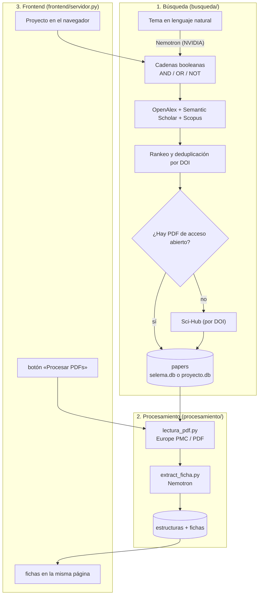

# Research Automator

Research Automator es una herramienta de IA (LLM + RAG) para revisiones de literatura científica. A partir de un tema en lenguaje natural genera cadenas de búsqueda booleanas, las ejecuta en varias plataformas académicas, rankea y deduplica los papers, descarga su texto completo y extrae hallazgos estructurados con un LLM.

El proyecto está estructurado en tres módulos independientes que se combinan en el frontend:

- **Búsqueda** (`busqueda/`) — recolección de papers.
- **Procesamiento** (`procesamiento/`) — extracción y análisis con LLM.
- **Frontend** (`frontend/`) — interfaz web que combina los dos anteriores.

---

## Flujo general


```mermaid
flowchart TD
    subgraph BUSQUEDA["1. Búsqueda (busqueda/)"]
        A["Tema en lenguaje natural"] -->|"Nemotron (NVIDIA)"| B["Cadenas booleanas<br/>AND / OR / NOT"]
        B --> C["OpenAlex + Semantic Scholar + Scopus"]
        C --> D["Rankeo y deduplicación por DOI"]
        D --> E{"¿Hay PDF de acceso abierto?"}
        E -->|"no"| F["Sci-Hub (por DOI)"]
        E -->|"sí"| G[("papers<br/>selema.db o proyecto.db")]
        F --> G
    end

    subgraph PROCESAMIENTO["2. Procesamiento (procesamiento/)"]
        G --> H["lectura_pdf.py<br/>Europe PMC / PDF"]
        H --> I["extract_ficha.py<br/>Nemotron"]
        I --> J[("estructuras + fichas")]
    end

    subgraph FRONTEND["3. Frontend (frontend/servidor.py)"]
        W["Proyecto en el navegador"] --> B
        PB["botón «Procesar PDFs»"] --> H
        J --> TW["fichas en la misma página"]
    end
```

Hay dos formas de recorrer este flujo:

1. **Por línea de comandos**, módulo por módulo, contra la base global `busqueda/output/selema.db` (ver `COMANDOS.md`).
2. **Por el frontend** (`frontend/servidor.py`): cada proyecto que creas en el navegador vive en su propia base (`busqueda/output/proyectos/<nombre>.db`) y ahí mismo puedes correr "Procesar PDFs" sin tocar la terminal.

---

## Instalación

```bash
python3 -m venv venv
source venv/bin/activate
pip install -r requirements.txt       # todo el proyecto
# o, si solo quieres la búsqueda (sin Nemotron Parse ni PyMuPDF):
pip install -r busqueda/requirements.txt
```

Copia `.env.example` a `.env` en la raíz y completa las keys que necesites (detalle de cada una más abajo).

---

## 1. Búsqueda (`busqueda/`)

Automatiza la generación de cadenas de búsqueda y la recolección de papers.

- **Generación de cadenas**: un LLM convierte el tema en lenguaje natural en cadenas booleanas (`AND`/`OR`/`NOT`), editables antes de lanzar la búsqueda (`generar_cadenas.py`). Usa Nemotron (NVIDIA), al que se le piden solo los términos de cada grupo y el código arma la sintaxis (comillas, `OR`, `AND`, `NOT`), porque escribiendo la cadena completa ignoraba los operadores; en español/«Ambos» un segundo paso corto restaura las tildes; si no responde, la interfaz arma cadenas básicas con las palabras del tema. El tema se puede escribir en español; las cadenas salen por defecto en inglés, porque casi toda la literatura indexada está en ese idioma (la misma cadena en español encuentra del orden de 50 veces menos papers).
- **Papers científicos**: busca en paralelo en [OpenAlex](https://openalex.org), [Semantic Scholar](https://www.semanticscholar.org) y Scopus; fusiona resultados, rankea y busca copias de acceso abierto.
- **Semantic Scholar re-rankeado en local**: su búsqueda que entiende operadores booleanos (bulk) solo ordena por citas, y los más citados del área se desviaban del tema. `fetch_semantic_scholar.py` trae un pool de hasta 100 resultados y devuelve los mejor puntuados por las keywords de la propia cadena (`rank_and_filter`), al mismo costo en solicitudes (medido en `pruebas/cadenas/sonda_s2_v2.py`: 12/26 de estricta/laxa del top por citas contra 15/30 del re-rankeado, con pool lleno).
- **Ejecución en OpenAlex** (medida con el banco de pruebas `pruebas/cadenas/amplitud.py`, 8 temas y juez LLM sobre los títulos): al traducir la cadena se ignoran las comillas de las frases exactas (encuentra de un 15 % a nueve veces más papers con la misma precisión) y si la búsqueda en título y abstract trae menos de `UMBRAL_RESCATE_FULLTEXT` (15) se aplican dos rescates que se fusionan: primero cada par de grupos AND (la variante de mejor precisión medida) y después el texto completo (`default.search`). Con `OPENALEX_API_KEY` en `.env` (gratis) se evita el 429 del presupuesto diario compartido por IP; sin key se usa el "polite pool" vía `mailto`.
- **Acceso a texto completo**: integra [Sci-Hub](https://sci-hub.ru) (opcional, `USAR_SCIHUB` en `config.py`) para resolver PDFs por DOI cuando las plataformas tienen el archivo bloqueado.
- **Abstracts**: Scopus no entrega el abstract; `completar_abstracts.py` lo pide por DOI a OpenAlex, Crossref y Europe PMC (gratis, sin key) antes de rankear.
- **Autonomía**: todo se guarda en SQLite. Corriendo por línea de comandos no necesita ningún LLM salvo para generar las cadenas (eso solo pasa en el frontend).

```bash
cd busqueda
python main.py
```

Configuración en `busqueda/config.py` (`PAPER_QUERIES`, años mínimos, `USAR_SCIHUB`, etc.).

---

## 2. Procesamiento (`procesamiento/`)

Toma los papers de la búsqueda y arma una *ficha* de cada uno leyendo solo las piezas que importan. Ya no se extraen variables sueltas (temperatura, pH...): sin el contexto del paper no eran utilizables.

### 2.1 Estructura del paper
`lectura_pdf.py` obtiene cinco piezas: el **abstract**, el **penúltimo y el último párrafo de la introducción** (el problema y el objetivo), las **conclusiones** y las **tablas** (nombre y atributos = encabezados de columna). Si el paper está en Europe PMC se lee su XML gratis; si no, se descarga su PDF **a memoria** (nunca se guarda en disco) y se lee en dos tiempos: primero en local y gratis con `pymupdf` (abstract, introducción y conclusiones salen del texto, y se anota en qué páginas están los títulos `Table N`), y después solo esas páginas, hasta `MAX_PAGINAS_TABLAS_PARSE`, van a Nemotron Parse (NVIDIA; lee cada página como imagen y tarda decenas de segundos por página, por eso las páginas se leen en paralelo) para leer bien las tablas. Un PDF con un formato que el lector local no entiende se envía parcialmente, pero con las páginas exactas que `pymupdf` ubicó: las primeras `PAGINAS_INICIALES_PARSE`, las de las conclusiones y las de los títulos de tabla. Solo un PDF escaneado (sin texto, imposible de ubicar) usa las primeras y las últimas, hasta `MAX_PAGINAS_PARSE`. Solo se guarda en la tabla `estructuras` el texto de las piezas, no el PDF, y así no se vuelve a leer.

Se leen los papers de acceso abierto y los que Sci-Hub resolvió por DOI (que traen `pdf_url`). Sci-Hub solo se consulta para papers de 2021 o anteriores (`SCIHUB_ULTIMO_ANIO` en `busqueda/config.py`): después de esa fecha dejó de agregar papers.

### 2.2 Ficha con Nemotron
`extract_ficha.py` envía esas piezas (varios papers por solicitud) a Nemotron (NVIDIA; `HILOS_LOTES_FICHA` lotes a la vez) y guarda en `fichas`: resumen, objetivo, conclusiones, hallazgos clave y qué aporta cada tabla. Un paper sin PDF accesible recibe una ficha **parcial** (solo el abstract). También marca los papers no relevantes para el tema del proyecto. Es incremental: si las piezas y el prompt no cambiaron, no se vuelve a llamar al modelo. La interfaz muestra además las piezas tal como salen del paper (abstract, párrafos de la introducción y conclusiones), sin pasar por el modelo.

Necesita `NVIDIA_API_KEY` y `NVIDIA_PARSE_API_KEY` en `.env`; el modelo y las URL van en `busqueda/config.py` (no son secretos).

```bash
cd procesamiento
python probar_nvidia.py                # prueba de conexión con Nemotron y Nemotron Parse
python lectura_pdf.py paper.pdf  # estructura de un PDF local
python extract_ficha.py --top 20 --tema "..."  # fichas de los mejores papers del ranking
python extract_ficha.py --forzar       # vuelve a leer y a generar aunque ya existan
```

---

## 3. Frontend (`frontend/`)

Interfaz web que combina Búsqueda y Procesamiento. Cada proyecto de investigación:

1. Se describe en lenguaje natural → genera cadenas de búsqueda editables.
2. Lanza la búsqueda → resultados rankeados, con selección manual de papers.
3. Los resultados tienen dos pestañas. **Resultados de búsqueda** es la tabla de papers (filtros, selección, exportar CSV). **Resultados de procesamiento** es donde se lanza "Procesar PDFs": se elige el alcance (la selección o todos, con un tope por corrida de `MAX_PAPERS_PROCESAR_WEB` en `config_proc.py`) y corre `extract_ficha.py` (Nemotron Parse + Nemotron) sobre la base propia de ese proyecto (`busqueda/output/proyectos/<nombre>.db`), **nunca** sobre `selema.db`.
4. Mientras corre, esa pestaña muestra el avance por paper y el log; al terminar, el resumen (fichas, papers con PDF leído, solo abstract, estado por paper) y una ficha por paper: resumen, objetivo, abstract, penúltimo y último párrafo de la introducción, conclusiones (texto del paper y resumidas), hallazgos clave y tablas (nombre + atributos), con búsqueda, filtros y exportación a CSV. Si la corrida falla o se cancela, lo ya procesado queda como resultado parcial y se puede reintentar (los papers con ficha no se vuelven a leer ni a enviar al modelo).

**Aclaración del tema.** Al pulsar «Generar cadenas», Nemotron evalúa si el prompt es lo bastante concreto (objeto de estudio, qué se quiere saber, contexto). Si no, hace hasta 4 preguntas (máximo 2 rondas, con ejemplos de respuesta) en la misma pestaña; con las respuestas reescribe el tema y a partir de ahí genera las cadenas. Se puede omitir. El tema refinado también se usa para marcar papers no relevantes.

**Límites de cada motor.** `busqueda/limites_motores.py` ajusta cada cadena al motor antes de enviarla, sin intervención: OpenAlex (URL de ~4 KB, hasta 100 alternativas por filtro), Scopus (máximo recomendado de 50 operadores booleanos) y Semantic Scholar (sin tope publicado; se usa un tope prudente de URL). Si no cabe, se quitan primero las últimas alternativas OR del grupo más largo y se avisa en la consola; la cadena guardada en el proyecto no se modifica.

**Dos partes.** `frontend/servidor.py` es el backend (la API en `/api/proyectos…`, en Python con la librería estándar). La interfaz nueva vive en `frontend/web-next/`, un proyecto **Next.js** (App Router, React, TypeScript) con su propio `package.json`. La interfaz anterior (`frontend/web/`, HTML y JS sin framework, estilo Nocturne) todavía la sirve `servidor.py` en `http://127.0.0.1:8000` hasta confirmar la paridad.

**Comunicación.** El navegador solo habla con Next. Un Route Handler (`web-next/src/app/api/[...ruta]/route.ts`) reenvía `/api/*` al backend, cuya dirección sale de `API_URL` (por defecto `http://127.0.0.1:8000`); así no hace falta CORS y el backend no cambia. El avance de la búsqueda y del procesamiento se consulta cada 1 s mientras hay algo en curso.

**Estructura de `web-next/src/`.**

- `app/` — layout, página única y el proxy de la API. `organic.css` es el sistema de diseño Organic (tokens y componentes base) y `globals.css` las utilidades compartidas.
- `lib/` — `tipos.ts` (contrato de la API), `api.ts` (cliente tipado) y `formato.ts` (funciones puras).
- `hooks/` — `useProyectos` (lista, proyecto activo, fichas y sondeo) y `useAclaracion` (rondas de preguntas).
- `context/AppContext.tsx` — une los hooks y expone las acciones del flujo, los diálogos de confirmación y los avisos.
- `components/` — `layout/` (barra lateral, encabezado, avisos), `vistas/` (prompt, aclaración, cadenas, búsqueda en curso, resultados), `resultados/` (tabla, panel de paper, procesamiento y fichas) y `ui/` (diálogo y toast). Cada componente trae su archivo `.module.css`.

**Diseño.** Viene de Claude Design (sistema Organic: fondo crema, acento terracota, Caprasimo y Figtree). Se conservan las rutas de la API y el flujo anterior; el tope «Máx. papers por corrida» se muestra de solo lectura porque lo fija el servidor.

```bash
# Backend (desde la raíz, con el venv activo)
cd frontend
python servidor.py        # API en http://127.0.0.1:8000
python servidor.py 8080   # en otro puerto

# Interfaz Next.js (en otra terminal)
cd frontend/web-next
npm install               # solo la primera vez
npm run dev               # http://localhost:3000
```

El backend no agrega dependencias propias: reutiliza los módulos de `busqueda/` y `procesamiento/` (ver `frontend/servidor.py`, que agrega ambas carpetas a `sys.path` al arrancar). Las dependencias de la interfaz (`next`, `react`, `react-dom`, `lucide-react`, `typescript`) viven solo en `web-next/package.json`.

---

## Variables de entorno (`.env` en la raíz)

| Variable | Para qué | Dónde se usa |
|---|---|---|
| `EMAIL_ADDRESS` | Identificación ante las APIs académicas (buena práctica, no es secreto) | `busqueda/config.py` |
| `OPENALEX_API_KEY` | Opcional: cuota propia en OpenAlex (sin ella, el presupuesto diario se comparte por IP y se agota con 429) | `busqueda/fetch_papers.py` |
| `SEMANTIC_SCHOLAR_API_KEY` | Búsqueda en Semantic Scholar | `busqueda/fetch_semantic_scholar.py` |
| `SCOPUS_API_KEY` / `SCIENCEDIRECT_API_KEY` | Búsqueda en Scopus | `busqueda/fetch_scopus.py` |
| `NVIDIA_API_KEY` | Nemotron: aclara el tema, genera las cadenas y arma las fichas | `busqueda/generar_cadenas.py`, `procesamiento/extract_ficha.py` |
| `NVIDIA_PARSE_API_KEY` | Nemotron Parse: lee las tablas y los PDFs que el lector local no entiende | `procesamiento/lectura_pdf.py` |

Lo **no secreto** no va en `.env`: el modelo de NVIDIA y las URL están en `busqueda/config.py` (los comparten búsqueda y procesamiento), y los parámetros del procesamiento en `procesamiento/config_proc.py`.

---

## Alcance y próximos pasos

Flujo del producto: **aclarar el tema → generar cadenas → (el usuario las revisa) → buscar y mostrar lo importante → extracción opcional de abstract, penúltimo y último párrafo de la introducción, conclusiones y tablas con sus atributos.**

| Paso | Estado |
|---|---|
| Aclaración del tema con preguntas (`generar_cadenas.aclarar`) | ✅ Hecho |
| Cadenas booleanas, revisadas y editadas por el usuario | ✅ Hecho |
| Búsqueda en OpenAlex, Semantic Scholar y Scopus + ranking + dedupe por DOI | ✅ Hecho |
| Estructura del paper (abstract, intro, conclusiones, tablas) | 🟡 Funciona; falla con PDFs bloqueados por la editorial (403) y con formatos atípicos |
| Ficha con Nemotron | ✅ Hecho |
| Migrar de SQLite a MongoDB | ❌ Pendiente (decisión tomada) |
| Despliegue (Render / Railway) | ❌ Pendiente |
| Exportar parámetros a Aspen | ❌ Por explorar |

El flujo anterior (extracción de variables, esquemas YAML, árbol de decisión, normatividad, cruce con el mercado y dashboard Streamlit) se eliminó del código; sigue en el historial de git.

---

## Estructura del Proyecto

```text
├── busqueda/
│   ├── main.py                      # CLI de la búsqueda
│   ├── config.py                    # Configuración de búsquedas y APIs
│   ├── generar_cadenas.py           # Cadenas booleanas con Nemotron
│   ├── fetch_*.py                   # OpenAlex, Semantic Scholar, Scopus, Sci-Hub
│   ├── llm_nvidia.py                # Llamada a Nemotron (NVIDIA) con reintentos; la usan búsqueda y procesamiento
│   ├── completar_abstracts.py       # Abstract por DOI (OpenAlex / Crossref / Europe PMC)
│   └── output/                      # selema.db, proyectos/<nombre>.db, CSV
├── procesamiento/
│   ├── lectura_pdf.py               # Estructura del paper: abstract, intro, conclusiones, tablas
│   ├── extract_ficha.py             # Ficha por paper con Nemotron (usa la de arriba)
│   ├── database_proc.py             # Tablas estructuras y fichas
│   ├── config_proc.py               # Parámetros del procesamiento
│   └── probar_nvidia.py             # Prueba de conexión con Nemotron y Nemotron Parse
├── frontend/
│   ├── servidor.py                  # Interfaz web (búsqueda + "Procesar PDFs")
│   ├── almacen.py                   # Persistencia de cada proyecto (SQLite propio)
│   └── web/                         # Página estática (HTML/CSS/JS)
├── .env                              # Variables de entorno y API keys (no se versiona)
├── .env.example                      # Plantilla de .env
├── requirements.txt                  # Dependencias de todo el proyecto
└── busqueda/requirements.txt         # Subconjunto: solo búsqueda
```
